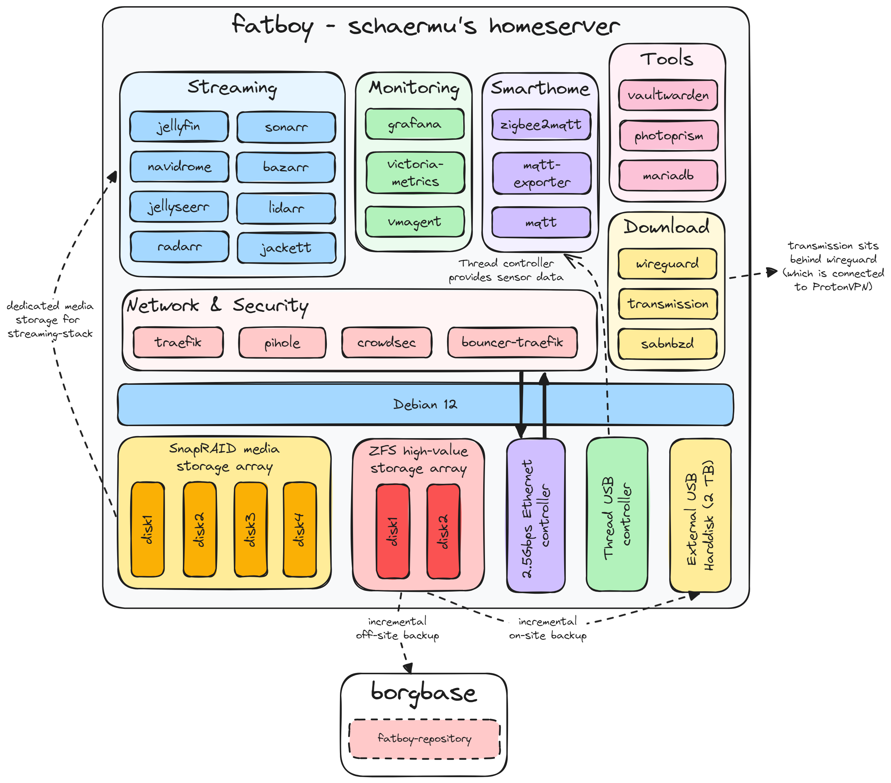

# System Overview

There are some special aspects in this setup:
* Several cronjobs are set up to sync the mergerfs array's parity using SnapRaid and to scrub the ZFS pool on a regular basis.
* Because I want to access several services from the internet (Grafana, Photoprism, Jellyseerr), a cronjob updates the Cloudflare DNS record with the external IP every 30 minutes.

## Server Configuration
There are some configurations necessary to make everything work properly.
### Logrotate
There are 2 additional logrotate scripts, one for traefik log rotation and another one toensure proper read permissions for the rootless crowdsec container:
#### /etc/logrotate.d/traefik
```
/var/log/traefik/*.log {
  size 10M
  rotate 5
  missingok
  notifempty
  postrotate
    /usr/bin/docker kill --signal="USR1" traefik
  endscript
}
```

#### /etc/logrotate.d/set_acls
```
{
    postrotate
        /usr/bin/setfacl -m g:1000:rx /var/log/kern.log
        /usr/bin/setfacl -m g:1000:rx /var/log/auth.log
        /usr/bin/setfacl -m g:1000:rx /var/log/ufw.log
        /usr/bin/setfacl -m g:1000:rx /var/log/syslog
        /usr/bin/setfacl -m g:1000:rx /var/log/traefik
    endscript
}
```

### Sudoers
To enable unsupervised backup creation using the scripts below, i use some commands that require non-interactive (hence passwordless) command invocation. In order to enable that, a sub set of apt-get and some mount-related commands are tagged in `/etc/sudoers`:
```
...

schaermu ALL=(ALL:ALL) NOPASSWD: /usr/bin/apt-get update *
schaermu ALL=(ALL:ALL) NOPASSWD: /usr/bin/apt-get upgrade --simulate
schaermu ALL=(ALL:ALL) NOPASSWD: /usr/bin/umount /mnt/docker-volume-backups/*
schaermu ALL=(ALL:ALL) NOPASSWD: /usr/bin/rm /mnt/docker-volume-backups/*
schaermu ALL=(ALL:ALL) NOPASSWD: /usr/bin/mount --bind -o ro /var/lib/docker/volumes/*
schaermu ALL=(ALL:ALL) NOPASSWD: /usr/bin/mkdir -p /mnt/docker-volume-backups/*

...
```

### Split-Horizon DNS
TODO

# Maintenance
## Updating
The repository is configured to update all docker compose stacks using [Renovate](https://github.com/renovatebot/renovate) on a regular basis. After Renovate's pull-requests have been merged, you can simply pull in the changes on your server using `git pull` and update either all stacks using `./update.sh --all` or a specific stack by executing `./update.sh [stack_name]`.

This script also cleans up old and unused images after restarting the stacks to make sure no disk space is wasted.

## Backing up
For runtime application data, the stacks use Docker volumes. There is a helper script called `backup-volumes.sh` which helps you integrate a proper and safe way to back up all docker volumes. If you want to set it up yourself, make sure you properly edit the included volumes on line 2 (`included_volumes`).

The script can be called with 2 arguments, `mount` and `unmount`:
* `mount` will read-only mount all included volumes to `/mnt/docker-volume-backups/[VOLUME]` and pause all containers using said volume.
* `unmount` reverses the above process by unmounting the volume, removing the mount point and resuming the paused containers.

So before triggering the actual backup using the backup tool of your choice, you have to call the script with `mount`, after the backup is done you should call `unmount`. Personally, i'm using [Borgmatic](https://torsion.org/borgmatic/) using its `before_everything` and `after_everything` hooks.

### Configurations
These configs are backed up as well, but are listed here for clarity:

#### ~/.config/borgmatic.d/docker-backup.yaml
```
# location
source_directories:
    - /home/schaermu/docker
    - /mnt/docker-volume-backups
one_file_system: true
repositories:
    - path: /mnt/external/borg.local
      label: local
    - path: ssh://REDACTED@REDACTED.repo.borgbase.com/./repo
      label: borgbase

# storage
archive_name_format: 'docker-backup-{now}'

<<: !include /etc/borgmatic/common.yaml

# hooks
before_everything:
    - echo "Preparing data backups."
    - /home/schaermu/prepare-backups.sh
before_backup:
    - echo "Starting a backup job."
    - findmnt /mnt/external > /dev/null || exit 75
after_backup:
    - echo "Backup created."
after_everything:
    - echo "Cleaning up data backups."
    - /home/schaermu/cleanup-backups.sh
on_error:
    - echo "Error while creating a backup."

# optional healthcheck
```

#### ~/.config/borgmatic.d/high-value-backup.yaml
```
# location
source_directories:
    - /home/schaermu/data-backups
    - /home/schaermu/.config/borgmatic.d
    - /etc/borgmatic
    - /mnt/tank/photos
one_file_system: true
repositories:
    - path: /mnt/external/borg.local
      label: local
    - path: ssh://REDACTED@REDACTED.repo.borgbase.com/./repo
      label: borgbase

# storage
archive_name_format: 'backup-{now}'

<<: !include /etc/borgmatic/common.yaml

# hooks
before_backup:
    - echo "Starting a backup job."
    - findmnt /mnt/external > /dev/null || exit 75
after_backup:
    - echo "Backup created."
on_error:
    - echo "Error while creating a backup."

# optional healthcheck
```

### ~/.config/borgmatic.d/music-local-backup.yaml
```
# location
source_directories:
    - /mnt/media/music
one_file_system: true
repositories:
    - path: /mnt/external/borg.local
      label: local

# storage
archive_name_format: 'music-backup-{now}'

<<: !include /etc/borgmatic/common.yaml

# hooks
before_backup:
    - echo "Starting a backup job."
    - findmnt /mnt/external > /dev/null || exit 75
after_backup:
    - echo "Backup created."
on_error:
    - echo "Error while creating a backup."
```